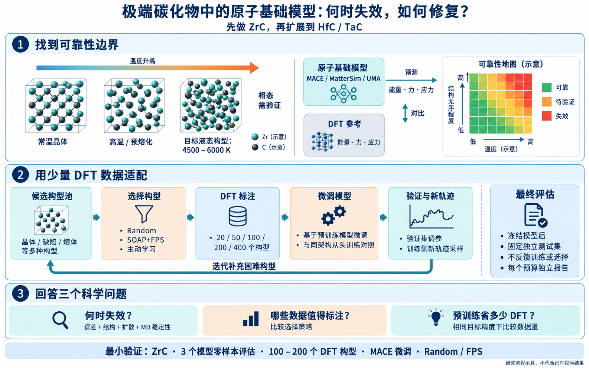

# 极端碳化物 Foundation MLIP

研究预训练机器学习原子间势（MLIP）在极端碳化物构型中的可靠性边界，以及用少量密度泛函理论（DFT）标注数据进行适配的效率。

**核心问题：模型何时失效？哪些构型值得标注？修复模型需要多少 DFT 数据？**

当前状态：项目结构、实验设计草案与流程图已建立；尚未执行 DFT、分子动力学（MD）、模型下载或训练。配置中的模型名称是候选方案，具体版本、权重和适配接口仍需核实。



## 从这里开始

- [原始项目描述](AI4S_carbide_foundation_MLIP_project_summary.md)
- [图解：项目在做什么](docs/project-guide.md)
- [实验设计与里程碑](docs/experiment-plan.md)
- [数据约定与复现要求](docs/data-protocol.md)
- [ZrC 最小验证配置](configs/experiments/zrc_mvp.json)

## 项目结构

```text
MaterialModel/
├── AI4S_carbide_foundation_MLIP_project_summary.md  原始构想
├── configs/experiments/   版本化的实验设计与预算
├── data/
│   ├── raw/              原始结构与输入资料
│   ├── candidates/       候选 MD 构型池
│   ├── labeled/          清洗后的 DFT 标注构型
│   └── splits/           训练/验证/测试构型 ID 清单
├── dft/
│   ├── templates/        经验证的计算输入模板
│   └── jobs/             DFT 作业与原始输出
├── src/carbide_mlip/     后续流程代码的模块位置
├── scripts/              后续命令行入口与作业提交脚本
├── models/               模型权重、检查点及来源记录
├── experiments/          单次运行记录与配置快照
├── results/
│   ├── metrics/          可追溯的评估指标
│   └── figures/          由真实结果生成的图表
├── notebooks/            探索性分析
└── docs/                 研究说明与概念示意图
```

大型数据、模型权重和计算输出默认不进入 Git；目录说明、实验配置与代码进入版本控制。详见各目录 README 和 `.gitignore`。

## 第一阶段范围

以 ZrC 为起点，完成三个候选基础模型的零样本评估，再用约 100–200 个适配用 DFT 构型开展 MACE 微调，对比 Random 和 SOAP+FPS，并加入同架构从头训练对照。独立验证与测试数据需要单独预留预算，不能全部消耗在训练构型上。

模型可靠性由 DFT 能量、力、应力误差与结构、扩散、MD 稳定性共同判断；不能只依据平均误差得出结论。4500–6000 K 是目标高温采样区间，相态需要验证。

## 当前下一步

确认计算资源、DFT 软件与参数收敛设置；锁定模型权重版本及使用条件；生成首批 ZrC 结构并验证数据和评估流程。研究方案中的温度网格、可靠性阈值和模拟时长尚待确定。
