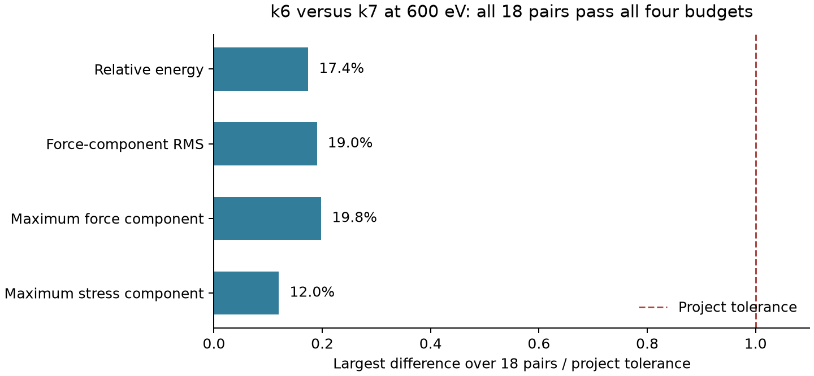
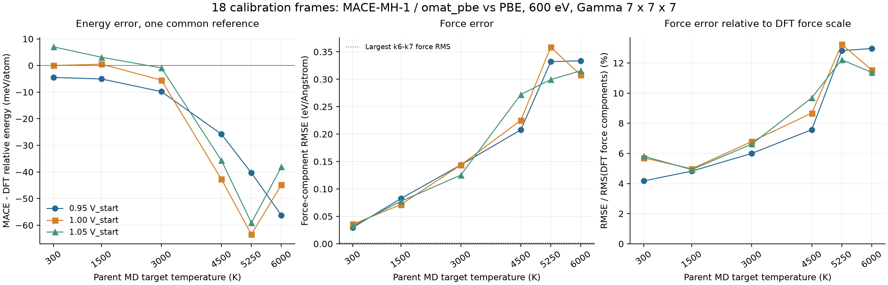

# ZrC 36项DFT审核、标注基准与MACE初步对照

日期：2026-10-08。结论：**36项计算全部通过本次完整性与电子收敛审核，18组k6/k7比较均满足原定四项误差预算。后续同类ZrC64静态标注采用600 eV、Gamma中心6×6×6作为工作基准。** 已对同18个构型完成MACE能量、力和静态应力比较；高温构型的模型偏差明显超过本次网格差异，但尚不能据此确定可靠温度边界或熔点。

机器可读[标注基准v1](../../../configs/experiments/zrc_dft_labeling_v1.json)、[审核摘要](summary.json)、[逐构型网格比较](kmesh-comparison.csv)、[MACE分温度统计](mace/mace-vs-DFT-by-temperature.csv)。

## 1. 回传结果与科学验收

原始包为`hpc/zrc-dft600-k67-results-20261008T080349Z-2174.tgz`，SHA-256为`a9d88ebadbcd3ff26073c1345c56ff095243c563a7f1fbef523c31612ac41e14`，与回传旁文件一致。安全解压至`hpc/results/zrc-dft600-k67-20261008/`；1251个文件，含36套完整输出。原始结果和冻结输入未改写。

| 检查 | 结果 |
| --- | --- |
| 输入身份 | 原包262条SHA-256全部通过，并与本地冻结包逐字节一致；运行目录的INCAR/POSCAR/KPOINTS/POTCAR及来源信息吻合 |
| VASP结束与SCF | 36/36正常结束、达到EDIFF；电子迭代17–23步，末步dE与d eps均小于1e-7 eV |
| 几何与标签 | 每项仅一个静态步，晶胞/原子顺序/位置保持；能量、力、应力均有限 |
| 电子与能带 | NELECT=512，实际NBANDS=336；全部最高能带占据输出为0 |
| 交叉解析 | pymatgen、ASE、XML直接解析与OUTCAR相互核对通过；OUTCAR小数截断与XML精度差单独保留 |
| 警告 | 36项均有NCORE=1效率警告和LREAL=Auto性能建议；未检出PSMAXN、BRMIX、EDDDAV等精度/收敛错误模式。保留LREAL=False，不按性能建议改标签精度设置 |

22号补算`15535277_22`在`ibc11b09n15`以`COMPLETED / 0:0`结束，调度耗时3:21:25，SCF为22步。旧`15501455_22`已取消，其空日志/启动异常历史保留；这次成功补算并不能证明旧节点的具体故障原因。36个有效结果由原数组35项加这次补算组成，无需再次执行22号恢复入口。

解析细节：原XML应力存在最多1.958×10⁻⁶ GPa的上下三角差；ASE读取上三角并在完整矩阵表示中镜像。核验统一到同一Voigt六分量后通过严格容差，未通过放宽判据掩盖差异。原始3×3矩阵与残差保存在[runs.json](runs.json)。

## 2. k6与k7比较：选用k6

36项对应18个独立构型，而不是36个独立样本：每个构型各算k6和k7。结构来自开发侧seed17，覆盖6个MD目标温度×3个初始体积比例，均为未弛豫的Zr32C32。

能量判据采用冻结参考`01_zrc64_T0300_v100_s17_f0085`：

`δErel(i) = [(E6(i)−E6(ref))−(E7(i)−E7(ref))] / 64`。

| 指标 | 18对中的最大绝对差 | 原定容差 | 最大值所在构型 |
| --- | ---: | ---: | --- |
| 相对能量 | 0.174049 meV/atom | 1 meV/atom | 08：3000 K，0.95Vstart |
| 力分量RMS | 0.00190038 eV/Å | 0.01 eV/Å | 02：300 K，0.95Vstart |
| 最大力分量 | 0.00593775 eV/Å | 0.03 eV/Å | 02：300 K，0.95Vstart |
| 最大应力分量 | 0.01198094 GPa | 0.10 GPa | 04：1500 K，1.00Vstart |

每对结构的四项指标都通过；不是仅平均值通过。未作参考对齐的绝对总能量差最大也仅0.195061 meV/atom，仍低于1 meV/atom。



成功任务的VASP运行时长合计：k6为52.674小时，k7为81.229小时；每项均56个MPI rank，k6少约35.2%。这是各次成功VASP运行时长的总和，排除旧22号异常和排队，不能当成整个项目的日历耗时；不同节点也使其不属于严格受控性能基准。实际k点数分别为112和172。

因此，本次数据没有提供为这类后续标签统一使用k7的充分收益。保留现有k7结果作为较密参考，后续使用k6。

## 3. 后续标注工作基准

| 内容 | 固定口径 |
| --- | --- |
| 程序、泛函、赝势 | VASP 6.3.2；PBE；原`potpaw_PBE.64`的Zr_sv/C，保持原字节身份和元素顺序 |
| 平面波与k点 | ENCUT=600 eV；Gamma中心6×6×6，无偏移 |
| 电子SCF | EDIFF=1e-7；ALGO=Normal；NELM=200；NELMIN=4；ISPIN=1 |
| 展宽 | ISMEAR=0；SIGMA=0.10 eV |
| 精度项 | PREC=Accurate；LREAL=False；LASPH=True；ADDGRID=False；LMAXMIX=4；ISYM=0 |
| 静态单点 | NSW=0；IBRION=-1；ISIF=2；ISTART=0；ICHARG=2 |
| 能带 | 保留自动选择并记录实际NBANDS；本批336条足够，每条新标签仍检查最高能带占据≤1e-6 |
| 主能量标签 | 原始TOTEN自由能，eV/晶胞；同时保存without-entropy与sigma→0能量供诊断 |
| 力与应力 | 力eV/Å；ASE拉伸为正的应力eV/ų，顺序xx yy zz yz xz xy |

选择TOTEN是为了和本协议输出的力/应力保持一致；Gaussian展宽的sigma→0能量与自由能不能互换。SIGMA=0.10 eV是固定数值展宽，不代表4500–6000 K的电子温度。[VASP展宽说明](https://vasp.at/wiki/Smearing_technique)

原VASP应力以压缩为正，kbar到本项目ASE应力的转换系数为`−0.1/160.21766208`；ASE已转换过的结果不再次变号。静态压力为`−trace(stress)/3`。[VASP应力约定](https://vasp.at/wiki/ISIF)

**适用范围与未认证项目：**该工作基准用于当前同成分、同64原子晶胞家族的后续标签。600 eV来自用户固定选择，本次并未改变ENCUT，故不能宣布截断能收敛、联合截断能/k点收敛或绝对数值精度已全面认证；k7也只是较密对照。体积比例是相对a=4.7 Å起始盒子，不是DFT平衡体积。更换8/216原子尺寸、胞形、成分、缺陷或未覆盖配位环境时，需要重新检查；不能机械复制6³网格。

每个新结果仍逐条验收正常结束、EDIFF、输入身份、几何不变、有限标签、能带占据和警告。现有18对只保留一份k6作为对应基准标签，k7保留为校准参考；不能把同一构型的两种网格作为两个独立训练/测试样本。现有旧优化、超胞和孤立原子目录不因本次结论自动成为可提交任务。

## 4. 当前结果与MACE的实际比较

已从原MD轨迹恢复并核验18帧保存的预测：MACE-MH-1、`omat_pbe`、mace-torch 0.3.16、float32。模型SHA-256、轨迹SHA-256、POSCAR、周期等价位置、晶胞、原子顺序及日志中的势能和势能压力均匹配。此次没有重新下载模型或重新运行MD。保存的坐标与力有extxyz八位小数舍入，远小于下述偏差；原推理发生在轨迹坐标序列化之前。

下面采用已有k7作为较密DFT对照，k6结果也完整保留。力直接逐原子逐分量比较。能量只减去同一个低温参考结构的模型—DFT偏移，未按温度或逐构型拟合：

`δE(i) = [(EMACE(i)−EMACE(ref))−(EDFT(i)−EDFT(ref))] / 64`。

参考结构的原始MACE−DFT(TOTEN)偏移为+18.4693 meV/atom。参考对齐使该结构误差按定义为零，因此本表能量结果属于参考依赖的相对能量诊断，不是无偏独立测试分数。

| MD目标温度 | 构型数 | 力分量RMSE / eV·Å⁻¹ | 参考对齐能量RMSE / meV·atom⁻¹ |
| ---: | ---: | ---: | ---: |
| 300 K | 3 | 0.03266 | 4.80 |
| 1500 K | 3 | 0.07716 | 3.44 |
| 3000 K | 3 | 0.13786 | 6.52 |
| 4500 K | 3 | 0.23657 | 35.41 |
| 5250 K | 3 | 0.33087 | 55.21 |
| 6000 K | 3 | 0.31913 | 47.01 |
| 全部 | 18 | 0.22110 | 33.14 |

每个温度的3帧分别来自3个体积，并非3个独立重复轨迹。力RMSE按全部3N分量计算；各帧原子数相同，分温度汇总等价于合并该温度全部分量求RMSE。



图中连线仅连接已测点，不代表连续温度范围已经验证。高温原子受力尺度增大，绝对RMSE自然可能上升；以DFT力RMS归一化后，多数低温/3000 K帧约4–7%，4500 K以上约8–13%，仍显示相对误差增大。5250→6000 K并非单调恶化。

全部18帧的静态应力六分量RMSE约0.6684 GPa，最大分量差约1.6014 GPa，平均压力偏差MACE−DFT为−0.5724 GPa。原候选清单中的`MACE_pressure_GPa`含原子动能贡献；本次采用轨迹的`model_stress`计算势能压力，与静态DFT对齐，未直接相减MD总压力。

这些结果有三方面价值：

1. **区分网格误差与模型偏差。**DFT k6/k7力RMS最多0.00190 eV/Å，明显小于MACE约0.03–0.33 eV/Å的分温度误差；相对能量与应力也有相同量级分离。继续统一加密到k7不太可能消除目前模型—所选DFT协议的偏差。
2. **定位值得补充标签的区域。**4500–6000 K帧的相对能量偏低，力误差也增大，适合成为下一轮模型校正与独立验证的重点；仍需保留低温及各体积样本，防止高温改善伴随低温退化。
3. **建立微调前的可复查对照。**同构型配对能量/力/应力比比较两个未配对能量直方图更有辨识力；后续可在固定独立验证集上用同口径检验标签收益。

模型原训练数据的全部DFT数值设置、赝势与能量目标尚未逐一匹配。这里量到的是MACE相对本项目协议的偏差，不能全部归因于高温外推能力。TOTEN与sigma→0的差仅0.324–1.533 meV/atom；改用sigma→0会略改表中数字，但不能解释高温35–55 meV/atom的能量RMSE。固定化学计量允许用单一参考消除常数能量偏移；进入真实微调前，仍需明确训练E0/能量参考处理，不把这次诊断平移直接写入原始标签。[MACE微调指导](https://mace-docs.readthedocs.io/en/latest/guide/finetuning_guidance.html)

## 5. 下一步与结论边界

建议下一步按以下顺序推进：

1. 按v1协议建立严格的标签验收/导出接口；18帧保持`calibration`身份，先不要混入独立验证或测试数据。
2. 固定模型可靠性指标与验证/测试标注预算，落实预留MD seed42/2026的最终清单。当前项目的模型可靠性阈值尚未定义，不能拿DFT数值容差当作MACE合格线。
3. 开发侧沿现有Random/SOAP+FPS冻结序列从20帧预算起步，采用k6标签；若先只用选样seed17，两策略20帧预算的训练标注并集为38帧，验证/测试预算另计。公平策略比较应保持冻结选择，不因本次误差事后改写一种策略；按误差定向补样可另设主动学习分支并记录规则。
4. 在相同标签预算下比较预训练零样本、微调与从头训练，并在未用于选样的验证/测试集报告分温度、体积、配位与相态误差；最终结合MD稳定性、结构/扩散、相态与尺寸检验评估边界扩展。

本次18帧全来自开发侧，一个温度仅3个体积点；实际相态、平衡性和常压条件尚未认证，6000 K只是采样上限。**目前支持“4500 K以上的已测构型误差增大，值得重点校正”，不支持“MACE在4500 K失效”“3000 K以下已可靠”或“已确定熔化温度”。**可靠边界需要事先定义指标并由独立数据和目标物性共同验证。

本次仅完成本地审核、比较和协议记录，未提交额外DFT、训练或MD任务。

## 6. 文件与复现

- [runs.json](runs.json)：36套标签、输入/输出哈希、逐项检查与耗时。
- [pairs.json](pairs.json) / [kmesh-comparison.csv](kmesh-comparison.csv)：18对逐构型比较与是否通过预算。
- [MACE完整对照](mace/mace-vs-DFT36.json) / [逐帧CSV](mace/mace-vs-DFT-per-frame.csv)：同时保留k6/k7和两种能量诊断。
- [MACE来源与预测](mace/mace18-recorded-predictions.json) / [独立ASE校验](mace/independent-ase-verification.json)。
- [网格审核脚本](../../../scripts/analyze_zrc_dft600_k67.py)、[MACE比较脚本](../../../scripts/compare_zrc_calibration_mace.py)、[制图脚本](../../../scripts/plot_zrc_dft_review.py)。

在项目根目录、具备本地原始结果/轨迹/模型的`carbide-analysis`环境中依次执行：

```powershell
conda run --no-capture-output -n carbide-analysis python scripts/analyze_zrc_dft600_k67.py
conda run --no-capture-output -n carbide-analysis python scripts/compare_zrc_calibration_mace.py
conda run --no-capture-output -n carbide-analysis python scripts/plot_zrc_dft_review.py
```

这些入口只读取科研原始数据，并更新本审核目录中的派生结果；不执行VASP、模型推理或作业提交。原始大型数据、赝势和权重按既有工作区边界保留本地。
