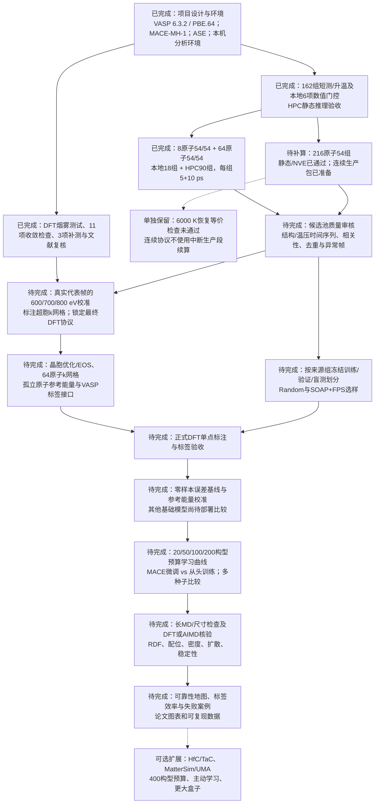

# 项目任务与进度（2026-09-23）

> 历史快照：本文108/162与216原子待补算的状态已被后续结果更新。首轮现为162/162数值完成；最新任务与进度见 [project-status.md](project-status.md)。本文保留当时证据与决策，不作为当前提交清单。

研究目标：确定基础原子势在极端碳化物中的可靠性边界，并测量用多少DFT数据能有效修复。当前主线为ZrC / MACE-MH-1，不等于已经完成全部模型和材料比较。

下图按任务依赖组织。已完成指相应工程或数值任务完成，不自动代表物理验证。108/162（66.7%）只代表首轮MD生产组合完成比例，不能当作整个研究项目完成比例。

## 状态核对

| 工作包 | 证据与当前边界 |
| --- | --- |
| CPU DFT部署及选参检查 | dft/reviews：新版smoke、11项收敛与3项补测完成。最高参考存在PSMAXN问题；600 eV是文献支持的待校准候选，不是已批准生产参数。 |
| 原子势与分析环境 | Windows推理/合成训练小测通过；V100作业15325225静态推理通过。合成训练不是正式研究训练。 |
| 首轮MD | 162组短测通过；108组生产段通过；216原子54组连续运行包本次准备，尚未提交或完成。 |
| 初始结构与物理语义 | a_start=4.7 Å，体积比例相对于初始体积；不是DFT优化体积。高温不能直接标为液相。 |
| 正式标签/数据划分/训练 | 尚未完成真实DFT标注集、冻结的独立划分、正式微调/从头训练、长时间物理验证。 |
| 扩展路线 | 原项目还包含多材料、多模型、主动学习；属于后续范围，不混入本次54组补算。 |

现有候选可开始分析和代表帧选取，不必等216全部结束才准备DFT协议校准。最终对比和尺寸结论仍须等所需结果及物理审核齐备。

## 显存与卡时

现有分尺寸实测是RTX 5060上MACE-MH-1/omat_pbe、float32的冷态E/F/stress推理基准，不是所有高温MD的峰值承诺：

| 原子数 | PyTorch峰值已分配 MiB | 峰值缓存保留 MiB | 约合已分配/保留 GiB |
| --- | ---: | ---: | --- |
| 8 | 192.18 | 218 | 0.188 / 0.213 |
| 64 | 659.47 | 714 | 0.644 / 0.697 |
| 216 | 1913.55 | 2286 | 1.869 / 2.232 |

来源：docs/environments/mace-box-benchmark.json。V100上作业15325225覆盖8/64/216原子、300/6000 K的六个单点，总体峰值已分配显存1855.01 MiB（1.812 GiB），没有逐尺寸峰值或完整生产段GPU利用率记录。已有54组合不能按温度/种子分别给出不存在的显存测量。高温短键、压缩导致邻居数变化；float64、训练反向传播、不同模型和批大小也改变占用。CUDA上下文/驱动开销不包括在上述PyTorch已分配数值内。训练显存尚未测量。

V100是32GB显存设备；提交参数--mem=32G申请的是主机内存，两者不同。新包在每次生产运行结束或可捕获失败时写resources.json，记录实际PyTorch峰值已分配/保留显存和耗时。

可以在一个获准的GPU分配内运行多个独立进程。以前采用一任务一卡，是为了简化排队、进程隔离和证据管理，不是已证明它卡时最省，也不是因为216原子一定占满32GB显存。

显存余量只说明可能装得下，不能证明算得更快。多个进程会竞争计算和内存带宽；若单进程受Python、邻居表、CPU和小kernel间隙限制，同卡并行可能提高吞吐。NVIDIA MPS可帮助部分多进程负载重叠，但需要集群支持，不能由显存比例直接推断收益。Slurm通常将单独申请gpu:1的作业分配到不同可用GPU；同卡共享需在一个分配内显式组织多个进程，或使用管理员配置的MPS资源。

设独跑一个任务T1小时，同卡同时跑n个任务、每个用Tn小时，单位任务GPU小时为Tn/n。只有Tn<n*T1才比串行省GPU小时。示例而非实测：单任务1小时；两任务同卡各1.3小时，则两任务总计1.3卡时，对比独立运行的2卡时节省35%；若各2.2小时反而多耗10%。实际费用还受集群计费规则影响。

合理的性能试验应比较1/2/4个并行进程的总MD步数每秒、每任务卡时、CPU占用和峰值显存，并保留同一计算精度与审核标准。目前没有这组V100吞吐实测，所以新包默认一任务一卡、最多4张卡并行，不宣称已经卡时优化，也不自动启用MPS。

官方依据：[NVIDIA MPS架构](https://docs.nvidia.com/deploy/mps/architecture.html)、[Slurm GPU与MPS资源管理](https://slurm.schedmd.com/gres.html)。

## 本次216原子交付

详见 hpc/zrc216-continuous/README.md。只包含原矩阵54组，0.5 fs/float32，原短测末态，同进程5 ps平衡+10 ps采样。中断保留旧run；显式重提后从原起点重跑整组，最多3次完整尝试。数值失败仍阻塞，不改门槛。旧恢复失败证据随包保留，新的执行协议不宣称恢复等价检查通过。
